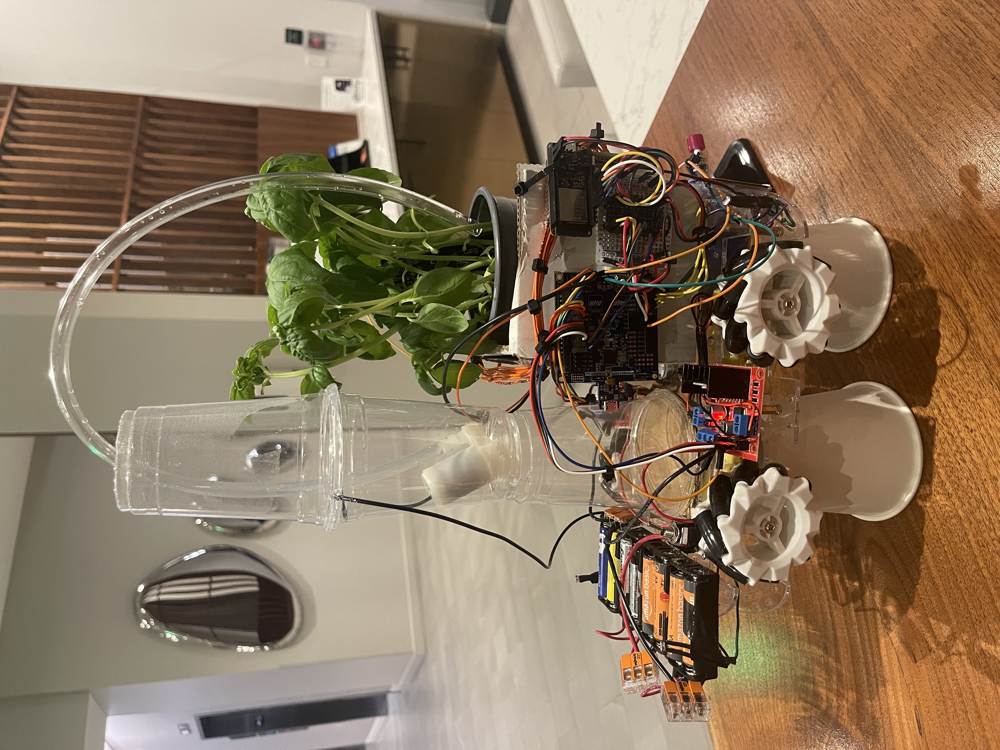
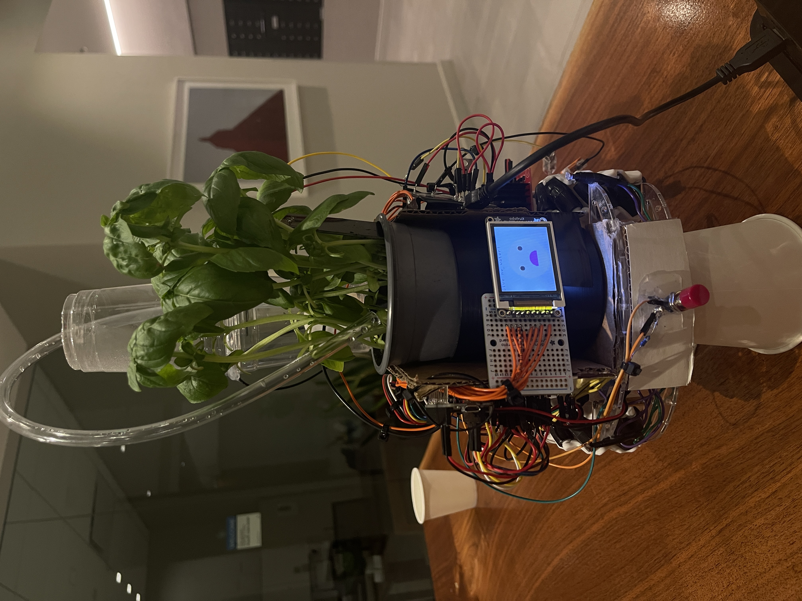

# final-project-skeleton

    * Team Name: Autonomous Tomato Plant
    * Team Members: Nami Lindquist, Gabriel Zhang
    * Github Repository URL: https://github.com/ese3500/final-project-autonomous-tomato-plant
    * Github Pages Website URL: [for final submission]
    * Description of hardware: macOS Monterey Version 12.5

## Final Project Proposal

### 1. Abstract
Our product makes taking care of plants easier. It includes a platform for the plant to rest on. The platform has wheels to give the plant mobility and has other features listed below. All of the final features are still in progress, but these are just a couple that we've decided to incorporate into the project.

1) The platform will constantly rotate in-place so that the sun is hitting all sides of the plant. This is a feature that the user can turn on or off. 
2) The platform will have wheels attached to the bottom of it and the movement of these wheels are dictated by a light sensor. When the light sensor senses too much light, the plant will roll away from the window and vice versa. 
3) There will be a moisture sensor attached to the leaf of the plant that will dictate a water-emitting mechanism to water the plant when it needs water. 
4) An IoT feature will use Blynk to manually move the plant and observe its metrics (e.g., light concentration, moisture level, etc.).
5) Since we are working with several different components, we will need to be careful about power management.
6) Our stretch goal is automatic collision avoidance for when the plant is moving around. 

### 2. Motivation
It's a pain to take care of a tomato plant. You have to adjust where you put the plant throughout the day to make sure that it's being exposed to the proper amount of sunlight and monitor its water levels, among many other things. This project is interesting because it has many easily-understandable features and it's something that we would use. The intended purpose is to make taking care of tomato plants, and plants in general, easier for busy people like us.

### 3. Goals
By the end of this project, we want to have all of our features listed above to be working, including our stretch goals. 

### 4. Software Requirements Specification (SRS)
* ADC for reading the sensors
* Timer for recording time between watering
* Interrupts for obstacle collision avoidance
* Blynk software (wireless communication)
* Path Planning (stretch goal)

### 5. Hardware Requirements Specification (HRS)
* ATMEGA328PB drives an additional motor controller to drive the stepper motors
* ATMEGA uses ADC to detect light and move the plant accordingly
* ATMEGA uses ADC to detect moisture and activates water spray
* ATMEGA communicates with ESP32 to connect to BLYNK
* ATMEGA uses ultrasonic sensor for avoiding collisions

### 6. MVP Demo
Basic functionality in all components, which are not integrated together yet. For instance, ATEMGA can drive motors, ATMEGA can detect light intensity, or ESP32 can connect to BLYNK.

### 7. Final Demo
Full product integration including both the electrical components and mechanical structure; demonstrate all functions.

### 8. Methodology
We will first get the motors to work and then try to control them based on the light sensor input. We will also try to first get the moisture sensor to work and then try to control the water-emitting mechanism to work based on the moisture sensor readings. Once these basic functions are working properly, we will try to connect this to the ESP32 and implement IoT-like features to the project. The ultrasonic sensor for obstacle collision will come later at the end as a stretch goal. 

### 9. Components
* ATMEGA328PB because we need an MCU
* Stepper Motors so that the plant can move around
* Motor Controller to drive the motors if we cannot directly drive the motors using the MCU
* ESP32 for connecting to WIFI
* LDR to detect sunlight on the plant
* Moisture sensor to detect the moisture levels of the plant
* Pump / fluid lines for watering the plant
* Any additional relays / PMICs needed to drive the actuators
* Battery to power all of this 
* Ultrasonic sensor for collision detection 

### 10. Evaluation
Here are several metrics for success that we've come up with.

* Maintain plant in sunlight 100% of the time (if direct sunlight is available) OR stop in the position where light intensity is maximized
* Travel without spilling / crashing
* Adjust watering to remove the need for human intervention 
* Display key metrics (such as moisture, sunlight) on IoT dashboard
* Achieve reasonable battery life

### 11. Timeline
Week 1 (March 26 - April 5)
* Getting all the sensors to work and being able to read them
* Getting the motor to work and understanding how to control it
* Getting the rotational motor to work

Week 2 (April 6 - April 12)
* Connect the motor movement to the readings from the light sensor
* Connection to Blynk

Week 3 (April 13 - April 19)
* Get the water-emitting mechanism connected to the moisture sensor

Week 4 (April 20 - End)
* Full product integration + attempting the implement collision avoidance

### 12. Proposal Presentation

Add your slides to the Final Project Proposal slide deck in the Google Drive.

## Final Project Report

Don't forget to make the GitHub pages public website!
If you’ve never made a Github pages website before, you can follow this webpage (though, substitute your final project repository for the Github username one in the quickstart guide):  <https://docs.github.com/en/pages/quickstart>

### 1. Video

[Insert final project video here]

### 2. Images

### 3. Results

What were your results? Namely, what was the final solution/design to your problem?

The final solution was a platform for the plant to be put onto. This platform has wheels that move in the direction with the most light concentration and can be manually moved with Blynk buttons. There is also an automatic watering capability and an OLED screen that displays to the user the state of the plant (happy, thirsty, drowning). Finally, we also included a crash button at the front of the car so that if it crashes into something, the car will stop moving. 

#### 3.1 Software Requirements Specification (SRS) Results

Based on your quantified system performance, comment on how you achieved or fell short of your expected software requirements. You should be quantifying this, using measurement tools to collect data.

#### 3.2 Hardware Requirements Specification (HRS) Results

Based on your quantified system performance, comment on how you achieved or fell short of your expected hardware requirements. You should be quantifying this, using measurement tools to collect data.

### 4. Conclusion

Reflect on your project. Some questions to consider: What did you learn from it? What went well? What accomplishments are you proud of? What did you learn/gain from this experience? Did you have to change your approach? What could have been done differently? Did you encounter obstacles that you didn’t anticipate? What could be a next step for this project?

The beginning of the project was stressful since our hardware parts took a significant amount of time to come. However, once we acquired our parts, testing the individual components worked very well, and powering everything went pretty smoothly for the most part; we did have some trip-ups with powering the ESP, but we found ways to do that efficiently. Figuring out how to control the motors also went smoothly. This laid a great, solid foundation for our work on this project. 

There are many things that we pivoted on when creating this project. The first is that we originally planned on implementing stretch goals that consisted of path-planning or object collision avoidance using an ultrasonic sensor. However, given the short amount of time that we had to complete this project, we decided against including path planning since that would require more sophisticated software than we had time to implement. We also decided against object collision avoidance using an ultrasonic sensor and instead implementing object collision avoidance using a push button since that was a simpler solution to object collision avoidance. Another thing we changed was the feature where the plant would constantly rotate in place; we just decided that this feature would drain too much power and was actually unnecessary for the end user. We also decided to use a moisture sensor that would be in the dirt of the plant rather than on the leaf of a plant since we weren't able to find any sensors that were supposed to be attached to the leaf that used ADC or would arrive on time when purchased online. 

When assembling the project, we were trying to 3D print a platform to which we could secure the MCU and ESP so that it would look nice and sleek, but we decided to use the resources around us in Detkin instead and used cardboard, tape, and hot glue to secure the boards on top of the chassis in a faster, simpler, and more cost-effective way. We used tape and hot glue to water-proof the water pump component.

On top of ensuring the proper functionality of all of the components, we also made an effort to make the project visually appealing and sturdy. To do this, we color-coded the wires the best we could and managed them with tape and zip ties. We also 3D printed an encasing for the plant and used cardboard to create space for the MCUs and ESP to fit nicely and neatly onto the chassis. We also made the OLED displays more visually appealing by using a face, in addition to text, to show the plant's status rather than just letting the user know of the plant's status with plain text. We are proud of executing this additional cherry-on-top visual appeal and hardware organization of the project. 

The next step for this project would be creating different water and sunlight settings that users could choose depending on the plant they are trying to take care of. Basil plants thrive in damp soil and constant sunlight, so this project was calibrated to a basil plant, but different types of plants would need a different kind of care so the functionality of the project would have to be different. 

Please note that there were changes in our SRS and HRS. One of the SRSs was using a timer for recording time between watering events, but we didn't implement this since we decided that it was unnecessary since we would simply water the plant depending on the moisture level of the soil. As noted earlier, we also decided against implementing the path planning SRS for reasons mentioned earlier. The one change that we made in the HRS is not using an ultrasonic sensor for reasons mentioned earlier.

## References

Fill in your references here as you work on your proposal and final submission. Describe any libraries used here.

## Github Repo Submission Resources

You can remove this section if you don't need these references.

* [ESE5160 Example Repo Submission](https://github.com/ese5160/example-repository-submission)
* [Markdown Guide: Basic Syntax](https://www.markdownguide.org/basic-syntax/)
* [Adobe free video to gif converter](https://www.adobe.com/express/feature/video/convert/video-to-gif)
* [Curated list of example READMEs](https://github.com/matiassingers/awesome-readme)
* [VS Code](https://code.visualstudio.com/) is heavily recommended to develop code and handle Git commits
  * Code formatting and extension recommendation files come with this repository.
  * Ctrl+Shift+V will render the README.md (maybe not the images though)
